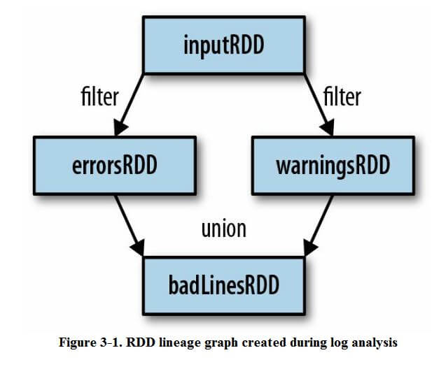
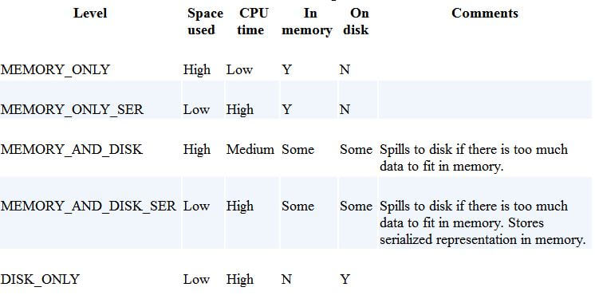

## 
## 0. 写在前面
代码示例在 [databricks/github](https://github.com/databricks/learning-spark)

## 1. Chapter 1. Introduction to Data Analysis with Spark

### What is Apache Spark

- Designed to be fast and general-purpose.
- Extends MP model, more computations, interactive query, streaming.
- Run computations in memory, also do well in data on disk.
- Easy to use, Python, Java, Scala and SQL, can access HDFS and Cassandra and so on.

### A Unified Stack

- Spark contains mutiple closely integrated components.
- Tight integration's benefits.
    + All components in the stack benefit from improvments at the lower layers.
    + The cost associated with running the stack are minimized.
    + Build app that seamlessly combine different models.
- Spark stack grpah:


### Spark Core

- The basic functionality of spark:
    + Task scheduling
    + Memory management
    + Fault recovery
    + Interacting with storage system
    + RDD definition

## 2. Chapter 2. Downloading Spark and Getting Started

- Spark itself is written in scala, and runs on the Java Virtual Machine. Need Java 6 or newer, if write Python, need Python 2.6 or 2.7, does not yet support Python 3.

### Using IPython

- IPYTHON: set this environment variable to 1 will use the IPython shell to access Spark when ./bin/pyspark
- IPYTHON_OPTS: set this environment variable to "notebook" will use the IPython notebook to access Spark when ./bin/pyspark

### Introduction to Core Spark Concepts

- Driver program: Contains the app's main function and defines distributed datasets on the cluster, then applies operations to them. In shells, the driver program is the Spark shell itself.
- Driver program access Spark through a SparkContext object, which represents a connection to a computing cluster.

## 3. Chatper 3. Programming with RDDs

- An RDD is simple a distributed collection of elements, in Spark all work is expressed as either creating new RDDs, transforming RDDs or calling operations on RDDs to compute a result.
- Two ways to create RDDs: 
    + Loading an external dataset;  
    + Parallelizing a collection in your driver program, not that widely used since it required that you have your entire dataset in memeory on one machine;
- RDD.filter() does not mutate the existing inputRDD, it just retures a pointer to an entirely new RDD, inputRDD can still be reused later in the program. For example, the execute graph of printing the error and warn message in a logfile is as bellow:

```
errorsRDD = inputRDD.filter(lambda x: "error" in x)
warningRDD = inputRDD.filter(lambda x: "warn" in x)
badLinesRDD = errorsRDD.union(warningRDD)
```



- Actions: The operations that return a final value to the driver program or write data to an external storage system. Should note that each time we call a new action, the entire RDD must be computed "from scratch", to avoid this inefficiency, users can persist intermediate results.
- Lazy evaluation: Spark will not begin to execute until it sees an action. 

### Persistence(Cache)

- If wish to use the same RDD mutiple times, Spark will recompute the RDD and all of its dependencies each time we call an action on the RDD, it's expensive for iterative algorithm, so that we need persist or cache data.
- The for cache level, defined in pyspark.StorageLevel or org.apache.spark.storage.StorageLevel:



- The default persist() will store the data in the JVM heap as unserialized objects, in Python, we always serialize the data persist stores, so the default is instead stored in the JVM heap as pickled objects, when write data out to disk or off-heap storage, the data is also always serialized. Off-heap caching is experimental and uses Tachyon.

- The ability to always recompute an RDD is actually why RDDs are called "resilient", when a machine holding RDD data losts, it can be recomputed the missing data.

## 4. Chapter 4. Working with Key/Value Pairs

- Key/Value RDDs are commonly used to perform aggregations, and often we'll do some initial ETL(extract, transform, load) to get our data into a key/value format.
- The advanced feature that lets users control the layout of pair RDDs across nodes is partitioning. Using controllable partitioning, applications can sometimes greatly reduce communications costs by ensuring that data will be accessed together and will be on the same node. 

### Data Partitioning(Advanced)

- Partitioning is important but not necessary for all applications, for if a given RDD is scanned only once, there is not point in partitioning it in advance. It's very useful when a dataset is reused multiple times in key-oriented operations such as joins. 
- There is a good example in the book, bellow is the comparison: 
    + Before


+ After


- partitionBy() is a transformation, RDDs can never be modified once created. Therefore need to persist and save as userData the result of partitionBy(), not the original sequenceFile(). Also, the 100 passed to partitionBy represents the number of partitions, which will control how many parallel tasks perform further operations on the RDD, in general, make this at least as large as the number of cores in your cluster.
- There is a PageRand example in this chapter.
