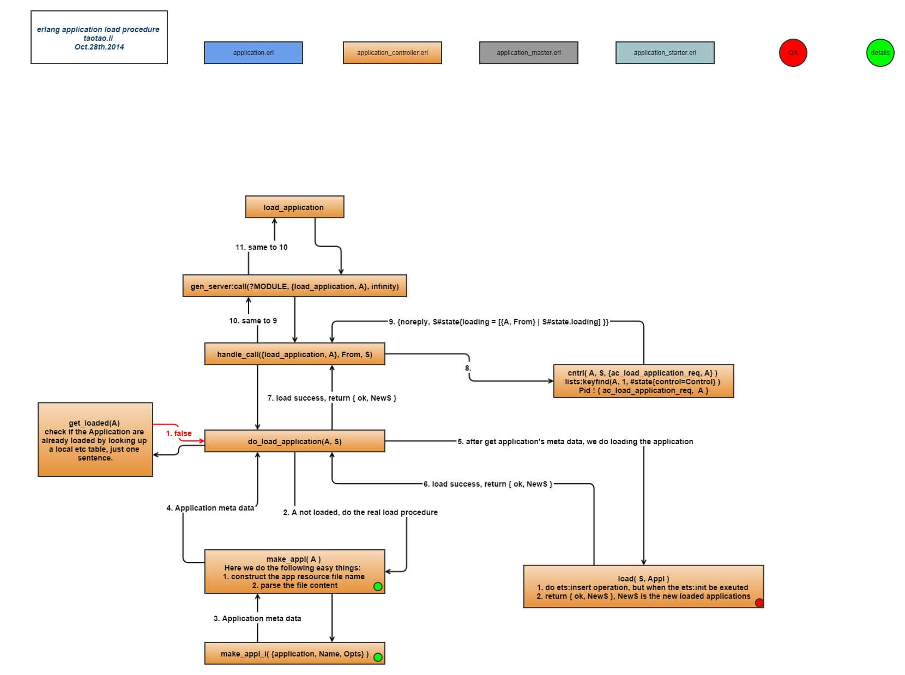

## 1. 从我在Erlang and OTP in Action中第六章中的错误说起
　　前两天看EOIA这本书，觉得终于可以用Erlang来搞点东西玩了，于是决定按照书中流程来实践一下所谓的缓存系统。
谨慎起见，我还是半抄半写把simple_cache的源码写好了，当前目录结构如下：

```
chenshan@mac007 6-EOIA$tree
.
├── ebin
│   ├── prim_consult.beam
│   ├── sc_app.beam
│   ├── sc_element.beam
│   ├── sc_store.beam
│   ├── sc_sup.beam
│   ├── simple_cache.app
│   └── simple_cache.beam
└── src
    ├── prim_consult.beam
    ├── prim_consult.erl
    ├── sc_app.erl
    ├── sc_element.erl
    ├── sc_store.erl
    ├── sc_sup.erl
    └── simple_cache.erl
```

**小提示：**   
> 1、要把src目录下的erl源文件编译，并把编译后的beam文件放到ebin下有一个快捷的方法，在当前目录下执行：erlc -o ebin/ src/*.erl；  
> 2、上面出现的prim_consult.erl和prim_consult.beam不用管，后面会提到的，这是我阅读application源码时提取出来的； 

　　然后进入ebin目录，打开erlang执行环境，用application:start(simple_cache).启动我们的缓存系统，opps，这个时候就出错了。   

```
chenshan@mac007 6-EOIA$cd ebin/
chenshan@mac007 ebin$erl
Erlang/OTP 17 [erts-6.1] [source] [64-bit] [smp:4:4] [async-threads:10] [hipe] [kernel-poll:false]

Eshell V6.1  (abort with ^G)
1> application:start(simple_cache).  
{error,
    {bad_return,
        {
        {sc_app,start,[normal,[]]},
         {'EXIT',
             {undef,
                 [{sr_store,init,[],[]},
                  {sc_app,start,2,[{file,"../src/sc_app.erl"},{line,6}]},
                  {application_master,start_supervisor,3,
                      [{file,"application_master.erl"},{line,326}]},
                  {application_master,start_the_app,5,
                      [{file,"application_master.erl"},{line,308}]},
                  {application_master,start_it_new,7,
                      [{file,"application_master.erl"},{line,294}]}]}}}}}

=INFO REPORT==== 22-Oct-2014::23:47:18 ===
    application: simple_cache
    exited: {bad_return,
                {
                {sc_app,start,[normal,[]]},
                 {'EXIT',
                     {undef,
                         [{sr_store,init,[],[]},
                          {sc_app,start,2,
                              [{file,"../src/sc_app.erl"},{line,6}]},
                          {application_master,start_supervisor,3,
                              [{file,"application_master.erl"},{line,326}]},
                          {application_master,start_the_app,5,
                              [{file,"application_master.erl"},{line,308}]},
                          {application_master,start_it_new,7,
                              [{file,"application_master.erl"},
                               {line,294}]}]}}}}
    type: temporary
2> 
```

## 2. 看看application行为在启动一个otp应用的简单流程
　　首先，在erlang环境下执行code:which(application)查看application编译后的文件路径：

```
Eshell V6.1  (abort with ^G)
1> code:which(application).
"/usr/local/lib/erlang/lib/kernel-3.0.1/ebin/application.beam"
```

　　然后，找到application的源文件，熟悉OTP项目目录结构的同志应该很清楚这里应该怎么做了吧，回顾一下OTP项目目录结构：  
> 
* doc  用于存放文档。如果文档时用EDoc生成，请将overview.edoc文件放在此处，其余的文件将会自动生成；
+ ebin  用于存放编译后的代码(.beam文件)，包含应用元数据的.app文件也应放在此处；
- include  用于存放公共头文件。所有作为公共API的一部分的.hrl文件都应该放在这个目录中。仅用于你自己的代码之中且不打算公开的私有.hrl文件则应该与其它源码文件一起放；
- priv  用于存放各种需要随应用一起发布的其他内容。定位priv目录的方法很简单：调用code:priv_dir(<application-name>)，便会以字符串形式得到priv目录完整路径；
- src  存放应用源代码；

　　所以简单就能找到application的源文件了，在/usr/local/lib/erlang/lib/kernel-3.0.1/src/下面，这个目录里面还有其他源文件，安全、简单的方法是拷贝到临时目录里来看，看下面：  

```
root@kali:~/Desktop/erl/6-EOIA/ebin# mkdir ~/Desktop/temp
root@kali:~/Desktop/erl/6-EOIA/ebin# cp /usr/local/lib/erlang/lib/kernel-3.0.1/src/application*.erl ~/Desktop/ temp/
root@kali:~/Desktop/erl/6-EOIA/ebin# ls ~/Desktop/te
temp/ test/
root@kali:~/Desktop/erl/6-EOIA/ebin# ls ~/Desktop/temp/
application_controller.erl  application.erl  application_master.erl  application_starter.erl
```

　　Ok, 一切就绪，开干了！先在application.erl里找到start这个函数，如下。  

```
-spec start(Application) -> 'ok' | {'error', Reason} when
      Application :: atom(),
      Reason :: term().

start(Application) ->
    start(Application, temporary).

-spec start(Application, Type) -> 'ok' | {'error', Reason} when
      Application :: atom(),
      Type :: restart_type(),
      Reason :: term().

start(Application, RestartType) ->
    case load(Application) of
  ok ->
      Name = get_appl_name(Application),
      application_controller:start_application(Name, RestartType);
  {error, {already_loaded, Name}} ->
      application_controller:start_application(Name, RestartType);
  Error ->
      Error
    end.
```

　　可以发现，start已经是一个很高层的封装了，源代码注释里也说了，application.erl只是对application_master.erl和application_controller.erl的一个封装。这里我们是调用了start/1，即以temporary为重启方式来启动我们的simple_cache。start过程从宏观上分为两大步：load和start。其中首先load，然后start，load的结果有三种：  
> 
- ok：加入start流程；  
- {error, {already_loaded, Name}}：失败，原因是这个应用已经load过了，可以直接加入start流程；  
- Error：错误，且错误原因不详，需要看console里的输出分析； 

　　Ok, 思路清晰了，我们就split it into two seperate but sequential procedures，一步一步来，争取最后不靠调试就解决我们上面遇到的问题吧， here we go！


## 3. load应用的过程分析   
　　根据application.erl 里第97行知道，load过程是调用application_controller.erl里的函数的，所以这里我们就先去分析application_controller.erl里的load调用了。先上一张图来简单看看load的整个过程。

　　上面的图可能画得稍显复杂，没办法，刚开始看源码，还是仔细一点好。仔细了解后，我发现load过程其中重点就只有下面四条：    

- 检查这个应用是否已经load过；  
- 解析应用描述文件appname.app里的内容；  
- 根据应用描述文件的描述，把应用的一些原子信息存到一张本地的ets表中；  
- 给应用的PID发送一条`{ac_load_application_req, AppName}`的消息；   

### 3.1 load过程中容易发生错误的地方  
- do_load_application 过程, 解析应用描述文件appname.app出错，相关源码如下。make_appl是一个解析appname.app文件的封装。

```
do_load_application(Application, S) ->
    case get_loaded(Application) of
        {true, _} ->
            throw({error, {already_loaded, Application}});
        false ->
            case make_appl(Application) of
                {ok, Appl} -> load(S, Appl);
                Error -> Error
            end
    end.
```

- 在cntrl(A, S, {ac_load_application_req, A})时发生错误，相关源码如下。但这里既是出错的话，返回的信息也是容易辨别的，即`{reply, ok, NewS}`，和上面我的那个出错不一样。看来程序在load的过程中没有出错，好吧，那我们就来看看在start的过程中出上面错了。

```
handle_call({load_application, Application}, From, S) ->
    case catch do_load_application(Application, S) of
        {ok, NewS} ->
            AppName = get_appl_name(Application),
            case cntrl(AppName, S, {ac_load_application_req, AppName}) of
                true ->
                    {noreply, S#state{loading = [{AppName, From} |
                                                 S#state.loading]}};
                false ->
                    {reply, ok, NewS}
            end;
        {error, _} = Error ->
            {reply, Error, S};
        {'EXIT', R} ->
            {reply, {error, R}, S}
    end;
```
　　PS: 因为这篇博文应该是26号发布的，到现在还么有通过分析源码的方式来找bug，所以为了让本文早点面世，我提前从出错信息里找错误了。事实证明，远远没有我想象的这样复杂，关键是这句`[{file,"../src/sc_app.erl"},{line,6}]},`， 我在sc_app.erl的第六行写错了一个字母，so...，不过后续我还会继续分析start过程，看看程序是怎么down的，也来看看怎么解读这个错误。

## 4. start应用的过程分析
