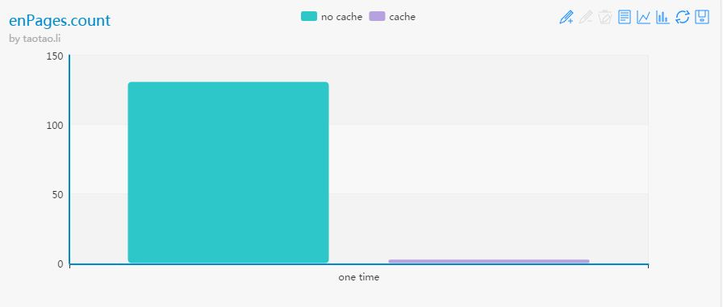

---
category: spark
published: false
layout: post
title: ［touch spark］3. 使用Spark分析wikipedia流量数据
description: 哇，spark还真不是盖的~~~
---  


　　本文是接上一篇的，所以序号就延续下来了。上一篇主要记录一些EC2配置和启动的问题，有兴趣请移步[Amazon AWS EC2 入门](../using-amazon-aws-1)


## 
##  
## 4. 利用spark来分析wikipedia流量数据  
　　启动spark shell。路径在/root/spark/spark-shell。

### 4.1  热身  
　　创建一个RDD，在spark-shell中，可以用sc代替SparkContext来创建RDD。这里需要注意一点，在Scala中有两种变量类型var和val，其中var是variable的缩写，val是value的缩写。顾名思义，var是可变的，val是不可变的。简单的可以把val理解成C/C++里的常量，或者Erlang里的变量【Erlang里的变量具有单次赋值的特征】。  

``` 
scala> var a ="aaa"
a: java.lang.String = aaa

scala> a = "a"
a: java.lang.String = a

scala> val b = "aaa"
b: java.lang.String = aaa

scala> b = "a"
<console>:12: error: reassignment to val
       b = "a"
         ^
```  

　　这里我们需要用val来指定一个新建的RDD，原因有2：第一，我们不需要对RDD做in place的改变，所以可以采用val来指定；其次，我们不应该对RDD做in place的改变，所以必须采用val来指定。下面，我们新建一个val型pagecounts变量，读取wikipedia 20GB的流量数据，并以两种方式打印前3条数据。  

``` 
scala> val pagecounts = sc.textFile("/wiki/pagecounts")
14/12/04 05:58:35 INFO mapred.FileInputFormat: Total input paths to process : 74
pagecounts: spark.RDD[String] = spark.MappedRDD@2fddef87

scala> pagecounts.take(3)
14/12/04 05:58:49 INFO spark.SparkContext: Starting job...
14/12/04 05:58:49 INFO spark.CacheTracker: Registering RDD ID 1 with cache
14/12/04 05:58:49 INFO spark.CacheTrackerActor: Registering RDD 1 with 177 partitions
14/12/04 05:58:49 INFO spark.CacheTracker: Registering RDD ID 0 with cache
14/12/04 05:58:49 INFO spark.CacheTrackerActor: Registering RDD 0 with 177 partitions
14/12/04 05:58:49 INFO spark.CacheTrackerActor: Asked for current cache locations
14/12/04 05:58:49 INFO spark.MesosScheduler: Final stage: Stage 0
14/12/04 05:58:49 INFO spark.MesosScheduler: Parents of final stage: List()
14/12/04 05:58:49 INFO spark.MesosScheduler: Missing parents: List()
14/12/04 05:58:49 INFO spark.MesosScheduler: Computing the requested partition locally
14/12/04 05:58:49 INFO spark.SparkContext: Job finished in 0.098193078 s
14/12/04 05:58:49 INFO spark.SparkContext: Starting job...
14/12/04 05:58:49 INFO spark.CacheTrackerActor: Asked for current cache locations
14/12/04 05:58:49 INFO spark.MesosScheduler: Final stage: Stage 1
14/12/04 05:58:49 INFO spark.MesosScheduler: Parents of final stage: List()
14/12/04 05:58:49 INFO spark.MesosScheduler: Missing parents: List()
14/12/04 05:58:49 INFO spark.MesosScheduler: Computing the requested partition locally
14/12/04 05:58:49 INFO spark.SparkContext: Job finished in 0.026119526 s
res1: Array[String] = Array(20090505-000000 aa.b ?71G4Bo1cAdWyg 1 14463, 20090505-000000 aa.b Special:Statistics 1 840, 20090505-000000 aa.b Special:Whatlinkshere/MediaWiki:Returnto 1 1019)

scala> pagecounts.take(3).foreach(println)
14/12/04 05:59:16 INFO spark.SparkContext: Starting job...
14/12/04 05:59:16 INFO spark.CacheTrackerActor: Asked for current cache locations
14/12/04 05:59:16 INFO spark.MesosScheduler: Final stage: Stage 2
14/12/04 05:59:16 INFO spark.MesosScheduler: Parents of final stage: List()
14/12/04 05:59:16 INFO spark.MesosScheduler: Missing parents: List()
14/12/04 05:59:16 INFO spark.MesosScheduler: Computing the requested partition locally
14/12/04 05:59:16 INFO spark.SparkContext: Job finished in 0.004355182 s
14/12/04 05:59:16 INFO spark.SparkContext: Starting job...
14/12/04 05:59:16 INFO spark.CacheTrackerActor: Asked for current cache locations
14/12/04 05:59:16 INFO spark.MesosScheduler: Final stage: Stage 3
14/12/04 05:59:16 INFO spark.MesosScheduler: Parents of final stage: List()
14/12/04 05:59:16 INFO spark.MesosScheduler: Missing parents: List()
14/12/04 05:59:16 INFO spark.MesosScheduler: Computing the requested partition locally
14/12/04 05:59:16 INFO spark.SparkContext: Job finished in 0.016392708 s
20090505-000000 aa.b ?71G4Bo1cAdWyg 1 14463
20090505-000000 aa.b Special:Statistics 1 840
20090505-000000 aa.b Special:Whatlinkshere/MediaWiki:Returnto 1 1019
```  

### 4.2 初试RDD Transfomation 和 RDD Action  
　　下面，我们来演示一个RDD Transformation的例子。首先，我们先看看这20GB的文件里有多少条数据，然后查询一下看所有流量数据中，有多少条是浏览的英文wiki。  
　　首先，执行pagecounts.count来查看有多少条数据。这个动作会产生177个spark任务，这里是从HDFS读书数据，所以这个任务的瓶颈实在I/O这块，整个任务执行下来大概2~3分钟。这里我执行了几次，大概花了2分钟左右的时间，执行结果如下：  

```
scala> pagecounts.count
.
.
.
14/12/05 01:19:58 INFO spark.SimpleJob: Finished TID 173 (progress: 177/177)
14/12/05 01:19:58 INFO spark.MesosScheduler: Completed ResultTask(0, 174)
14/12/05 01:19:58 INFO spark.SparkContext: Job finished in 95.251659404 s
res0: Long = 329641466
```

　　在任务运行的时候，可以打开web窗口访问：http://<master_node_hostname>:8080 来实时观察执行进度。下面是我的一个截图示例：  
  

　　现在，我们来利用现在这个RDD来trasform出另外一个RDD，用于记录英文wiki的数据。也通过把英文wiki的流量数据写到内存里，来比较一下数据在内存中和不在内存中两种情况下一些操作的耗时。这个测试需要下面4步：  
　　1. 通过trasformation生成一个RDD[enPages]，记录英文wiki流量数据，因为这个步骤也需要遍历一边所有数据，所以这个步骤耗时也应该和上一个 pagecounts.count 耗时相当。

``` 
scala> val enPages = pagecounts.filter(_.split(" ")(1) == "en")
enPages: spark.RDD[String] = spark.FilteredRDD@1b8f2e35

scala> enPages.count
.
.
.
14/12/05 01:51:01 INFO spark.SparkContext: Job finished in 114.035390332 s
res1: Long = 122352588
```  

　　2. 把enPages缓存到内存中  

```  
scala> enPages.cache
res0: spark.RDD[String] = spark.FilteredRDD@78bf34f4
```  

　　3. 执行enPages.count，看看执行速度有神马区别，what happened? 按照原计划，现在不应该是神速吗？仔细看看下面的执行log，是不是有一种恍然大悟的赶脚啊？  

```  
scala> enPages.count
.
.
.
14/12/05 01:59:33 INFO spark.SimpleJob: Size of task 0:176 is 10680 bytes and took 4 ms to serialize by spark.JavaSerializerInstance
14/12/05 01:59:33 INFO spark.CacheTrackerActor: Cache entry added: (2, 176) on ip-172-31-25-137.ec2.internal (size added: 16.0B, available: 6.0GB)
14/12/05 01:59:33 INFO spark.SimpleJob: Finished TID 176 (progress: 172/177)
14/12/05 01:59:33 INFO spark.MesosScheduler: Completed ResultTask(0, 176)
14/12/05 01:59:34 INFO spark.CacheTrackerActor: Cache entry added: (2, 170) on ip-172-31-25-139.ec2.internal (size added: 10.3MB, available: 5.0GB)
14/12/05 01:59:34 INFO spark.SimpleJob: Finished TID 169 (progress: 173/177)
14/12/05 01:59:34 INFO spark.MesosScheduler: Completed ResultTask(0, 170)
14/12/05 01:59:35 INFO spark.CacheTrackerActor: Cache entry added: (2, 172) on ip-172-31-25-137.ec2.internal (size added: 183.3MB, available: 5.8GB)
14/12/05 01:59:35 INFO spark.SimpleJob: Finished TID 171 (progress: 174/177)
14/12/05 01:59:35 INFO spark.MesosScheduler: Completed ResultTask(0, 172)
14/12/05 01:59:35 INFO spark.CacheTrackerActor: Cache entry added: (2, 175) on ip-172-31-25-138.ec2.internal (size added: 16.0B, available: 6.1GB)
14/12/05 01:59:35 INFO spark.SimpleJob: Finished TID 174 (progress: 175/177)
14/12/05 01:59:35 INFO spark.MesosScheduler: Completed ResultTask(0, 175)
14/12/05 01:59:36 INFO spark.CacheTrackerActor: Cache entry added: (2, 173) on ip-172-31-25-138.ec2.internal (size added: 16.0B, available: 6.1GB)
14/12/05 01:59:36 INFO spark.SimpleJob: Finished TID 172 (progress: 176/177)
14/12/05 01:59:36 INFO spark.MesosScheduler: Completed ResultTask(0, 173)
14/12/05 01:59:36 INFO spark.CacheTrackerActor: Cache entry added: (2, 174) on ip-172-31-25-139.ec2.internal (size added: 178.3MB, available: 4.8GB)
14/12/05 01:59:36 INFO spark.SimpleJob: Finished TID 173 (progress: 177/177)
14/12/05 01:59:36 INFO spark.MesosScheduler: Completed ResultTask(0, 174)
14/12/05 01:59:36 INFO spark.SparkContext: Job finished in 130.727017576 s
res0: Long = 122352588
```

　　4. 好，现在我们再次执行enPages.count，看看是不是有神马神奇的事情发生了。  

```
scala> enPages.count
.
.
.
14/12/05 02:12:01 INFO spark.SparkContext: Job finished in 2.492567199 s
res2: Long = 122352588
```  
　　
　　哇，130秒和2.5秒的对决，心算一下，52倍啊，如果visualize一下这个数据，估计会更让人吃惊吧。擅于YY的我不禁用echarts画了个图，感受一下内存计算的神速。画图代码如下，直接把代码粘贴到[echarts bar](http://echarts.baidu.com/doc/example/bar1.html#macarons)，在再点击刷新就可以看到图了。 

``` 
option = {
    title : {
        text: 'enPages.count',
        subtext: 'by taotao.li'
    },
    tooltip : {
        trigger: 'axis'
    },
    legend: {
        data:['no cache','cache']
    },
    toolbox: {
        show : true,
        feature : {
            mark : {show: true},
            dataView : {show: true, readOnly: false},
            magicType : {show: true, type: ['line', 'bar']},
            restore : {show: true},
            saveAsImage : {show: true}
        }
    },
    calculable : true,
    xAxis : [
        {
            type : 'category',
            data : ['one time']
        }
    ],
    yAxis : [
        {
            type : 'value'
        }
    ],
    series : [
        {
            name:'no cache',
            type:'bar',
            data:[130.727017576]
        },
        {
            name:'cache',
            type:'bar',
            data:[2.492567199]
        }
    ]
};

```

  
