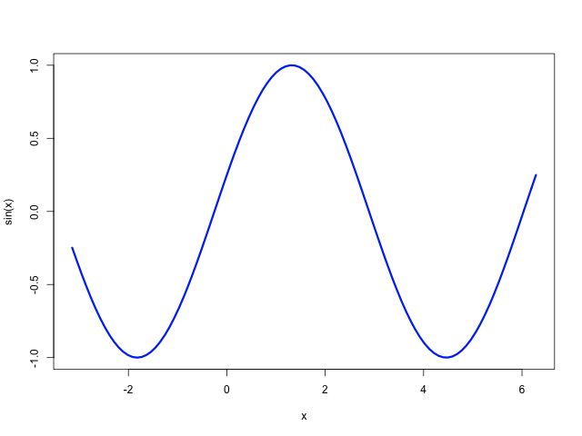

---
layout: post
published: false
title: ［touch spark］6. 终于等到你，spark streaming + 新浪微博数据  
description: 自从看到[databricks在spark summit 2014上的那个视频，我就一直想体会spark streaming的power，但心知万丈高楼平地起，所以一直默默地先打底层基础。现在，我觉得只有《终于等到你》这首歌的歌名能够表达我内心的激动了，我来了，streaming~~~
---  

##  
## 1. 写在前面
　　从最开始想尝试streaming的时候，我一心想实现databricks在spark summit 2014上的那个演示---实时获取twiiter数据，并做分析展示。无奈，在折腾twitter几天后只得放弃。刚开始注册twitter得需要手机号，可是twitter居然不支持中国内地的号码，这里不知道是twitter不支持，还是中国内地的运营商不支持twitter，我想应该是后者吧。当时纠结了好久，一种心碎的感觉。后来终于突然有一天无需手机号也能注册了，我欣喜若狂地注册了一个twitter号，后来发现尼玛新建一个twitter app需要手机验证，这下我就完全down机了，无奈，twitter这条路是完全走不通了。这段时间的心情，就像过山车一样，从心碎到兴奋再到最后的心死。  

　　可是我不死心啊，还行想玩玩streaming，想体验体验streaming的power，怎么办怎么办？我左思右想，想要做到databricks的效果，唯一的办法就是利用咱们天朝的新浪微博了。在调研了一下新浪微博的API后，其原理和twitter API的原理也是一样的，但是新浪微博的streaming API被取消了。好吧，硬骨头挺多，还得自己啃了。没办法，我想了想，就2个选择，要么不做，然后天天后悔；要么做，然后天天折腾。好吧，我承认我还是义无返顾地选择了第二条路，sigh。  
　　在写这篇博客的时候看到徐静蕾的新片《有一个地方只有我们知道》，里面一句话让我深有感触---**没有在一起的，就是不对的人，对的人，你是不会失去他的**，我也想说，没有学到的技术，就是你不喜爱的技术，喜欢的技术，你是不可能学不会的。

## 2. 实验目的
　　这次实验是想尝试一下spark streaming的效果，预期是这样的：通过每隔 **几秒** 从新浪微博拿到 **一些** 公开的微博数据，然后实时 **处理** 一下这些数据并 **展现** 出来。  
　　ok，这里的关键上面已经用粗体标记出来了。有两个方面，一是时间间隔的设置，数据流量的设置，这关系到streaming的稳定性，比如说若处理速度小于数据流入的速度的话，那数据会慢慢堆积起来；若数据流入速度小于处理速度的话，展现处理结果肯定也不好看。这里是属于tuning的环境，可以在spark官网上仔细瞧瞧，不过具体还是要根据应用需求来定。第二个方面是数据处理和展示，这应该是应用的核心了。这里我们做得很初级，简单做一些TF-IDF的测试或者是更简单的包含性测试。   
　　既然是第一次，那就不要太那啥，还是温柔一点比较好。暂时定一个目标，我们想看看实时微博中哪些是包含某某字段的，然后输出这些微博的信息。比如说，我想知道实时微博中，哪些是包含 **建设银行**，**涨** 这样两个关键字的微博，并实时打印出来。  

## 3. streaming，我的目标
　　既然要玩，那就玩得痛快点，下面是我准备在微博streaming这块做的一些各个版本的安排：   

- 数据方面：  
    + 第一步，能够获取微博伪实时数据即可【微博API请求有限制】；   
    + 第二步，自己设计一个搜集系统，能获取近实时的微博数据，希望能媲美原来微博的streaming API；  
- 应用方面：  
    + 第一步，啥都不干，确认spark   cluster能连到我的数据源，把所有接收到的数据简单打印出来；   
    + 第二步，简单处理，对实时数据流进行一个简单的filter操作，比如说，看看哪些消息是提到了某人，或某支股票；   
    + 第三步，复杂一点，用用MLib来对每条消息学习一下，其实就是高级的filter；   

　　目前我打算从上面几个小目标一点一点上，最近发现一个NB项目，Zeppelin，底层可以集成spark，届时看看是否有需要，可以尝试下
eppelin+spark。【最近我尝试编译过Zeppelin，遇到很多问题，目前这个项目还不是很成熟，不过项目组说了，他们正在迁移到Apache的孵化器中，完成迁移后会专心发布新版本。Good，看来的确是一个NB项目】   
　　冲啊，每天进步一点点。

## 2. 步骤规划
　　我们第一次的目标很简单，当然按照上面的说法，其实也就是三个步骤：  

- 拿数据，通过新浪微博API  
- 处理数据，即对每条微博进行一个检测，看是否包含“建设银行”，“涨”这两条关键字  
- 展示数据，简单的打印下来即可  

## 3. 新浪微博API使用
　　微博官方已经有详细的新手引导了，这里就不重复造轮子了，大家可以直接参考 [这里](http://open.weibo.com/wiki/%E6%96%B0%E6%89%8B%E6%8C%87%E5%8D%97)    
　　我用的是[Python SDK](https://github.com/michaelliao/sinaweibopy)  

## 4. 处理数据  
　　要看是否包含“建设银行”，“涨”这两个关键字就简单得多了，用python的话可以直接用 ` u'涨' in weibo_text and u'建设银行' in weibo_text` 就可以了，scala的话也有 `contains` 方法可以直接用。  

## 5. 展示数据  
