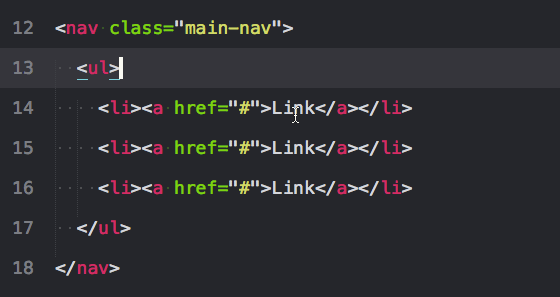

---
category: tools
published: true
layout: post
title: 我常用的 sublime 快捷键
description: 我常用的 sublime 快捷键
---  


## 
## 写在前面   

之所以要整理一下我常用的 sublime 快捷键，是源于一个 blog [如何提升你的能力？给年轻程序员的几条建议](http://tech.glowing.com/cn/advices-to-junior-developers/)。这个作者 [Ryan](https://github.com/yejianye) 是我的新boss，在当时第一次面试结束的时候，我问了他一个问题，像我这样子刚工作不久，基础不好的新人，应该怎么来提升自己。当时他简单的说了一下，内容和博文里面的差不多，没想到不到一个星期在公司的微信公众号上就出现了这样一篇文章。虽然不确定是不是因为我的那个问题而写的，但确实很感动。我想，在个人成长的过程中，如果有人能拉一把，那感觉就跟买股票时，有人突然给了一个内幕消息似的。无论如何，都要谢谢 Ryan，也要感谢他的这篇文章。  

我用sublime很久了，一些快捷用法也挺熟悉，不过似乎还没怎么整理过。估计以后都要和sublime同甘共苦了，还是很有必要好好总结一下的，所以就有了这篇博客。


## 1. 功能查找：ctrl + p

- 直接输入，可以快速查找文件
- 输入@+函数名，查找函数，这个功能还有快捷键：ctrl + r，已经直接在查找栏里不全了一个 @ 了。
- 输入#+文本，文件内文本匹配


## 2. 多选：ctrl + d

把光标放在一个单词上，按下ctrl + D,将选择这个单词。一直按住ctrl且按D多次，将选择当前选中项的下一个匹配项。




## 3. 打开关闭边栏： ctrl + k, ctrl + b   

这个功能个人觉得很实用，特别是有一个竖屏的时候，在竖屏上写代码时，ctrl + k, ctrl + b 把侧边栏关闭，那感觉叫一个酸爽啊，哈哈。


## 4. 文本查找：ctrl + f, ctrl + shift + f

ctrl + f：当前文件内查找
ctrl + shift + f：在当前打开的folder中的所有文件内查找，还可以有替代功能【在windows下，sumblime 2，好像用搜狗輸入法的中文時，不能使用这个功能，需要切换成美式键盘才可以使用这个功能】


## 5. 命令模式：ctrl + shift + p  

- minimap：隐藏或显示右侧的小地图
- set syntax：设置当前文本语法


## 6. 快速跳到某一行：ctrl + g

## 7. 完整拷贝，避免格式错乱：ctrl + shift + v

我们发现，在从别的文件中拷贝一段代码过来的时候，多半只是第一行缩进，后面都乱了，这时可以使用Ctrl + Shift + V进行粘贴，可以在粘贴的过程中保持缩进，这时格式都是正确的。

## 8. 重新打开关闭的标签：ctrl + shift + t

在Chrome里面，如果你不小心关闭了某个标签页并想恢复它，你可以按下Shift + Ctrl + T重新打开它。
在ST3中也一样，如果你不小心关闭了某个文件，可以按下Shift + Ctrl + T快速恢复。连续重复该按键，ST将会按照关闭的先后顺序重新打开标签页。

## 9. 上下移动行：ctrl + shift + 上下方向键

定位光标或选中某块区域，然后按 ctrl + shift + 上下方向键 可以上下移动改行。 

## 10. 删除整行：ctrl + shift + k / ctrl + x

同样的，在windows下，如果使用搜狗输入法的话，这样也会不能用，应该是被搜狗本身的快捷键覆盖了，需要切换到美式键盘才行。   

## 11. 强力分屏，宽屏的福音：shift + alt + 数字键

同样也是我经常使用的一个快捷键，因为有3个屏幕，一个笔记本，一个23的宽屏，一个19的竖屏。在竖屏上写代码时基本都是 ctrl + k, ctrl + b 关闭左侧边栏，在宽屏上写代码时常常会用 shift + alt + 2 切换成2屏，刷起来感觉刁刁的，爽爽的。

## 12. 关闭当前文件：ctrl + w

## 13. 选择行：ctrl + l

选择某行，重复可以依次增加选择下一行。

## 14. 全屏：F11， 全屏免打扰：shift + F11

## 15. 切换标签：alt + 数字

切换到第N个文件。

## 16. 快速查找下一个、上一个

选中单词，command + g，快速选中下一个，command + shift + g，快速选中上一个。

## 17. 缩进中tab转为space

command + , 打开用户设置，设置 "translateTabsToSpaces" 为 "ture"，然后保存一下就ok了。

顺便了解一下sublime加载配置文件的顺序：

Packages/Default/Preferences.sublime-settings
Packages/Default/Preferences (<platform>).sublime-settings
Packages/User/Preferences.sublime-settings
Packages/<syntax>/<syntax>.sublime-settings
Packages/User/<syntax>.sublime-settings

更多的配置详情可以查询这两个链接：

[config sublime 1](https://www.sublimetext.com/docs/2/indentation.html)
[config sublime 2](http://www.sublimetext.com/docs/indentation)


## 18. 安装插件

按Ctrl+`调出console，如果这个快捷键不管用，肯定是有其他工具占用了这个快捷键。如果成功调出console，粘贴下面的代码，安装package control组件。  

```
import urllib2,os;pf='Package Control.sublime-package';ipp=sublime.installed_packages_path();os.makedirs(ipp) if not os.path.exists(ipp) else None;open(os.path.join(ipp,pf),'wb').write(urllib2.urlopen('http://sublime.wbond.net/'+pf.replace(' ','%20')).read())
```

安装成功后重启sublime，command + shift + p调出命令面版，输入install，应该能找到install package的选项。


## 扫一扫     

