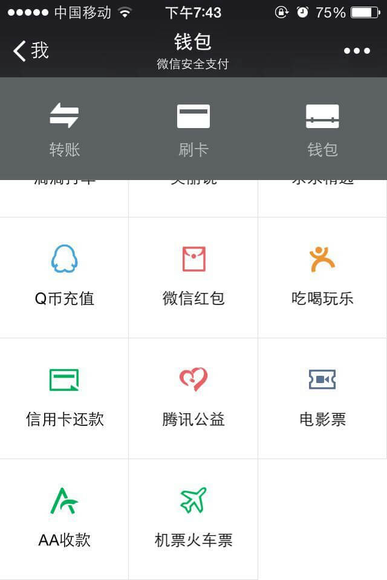
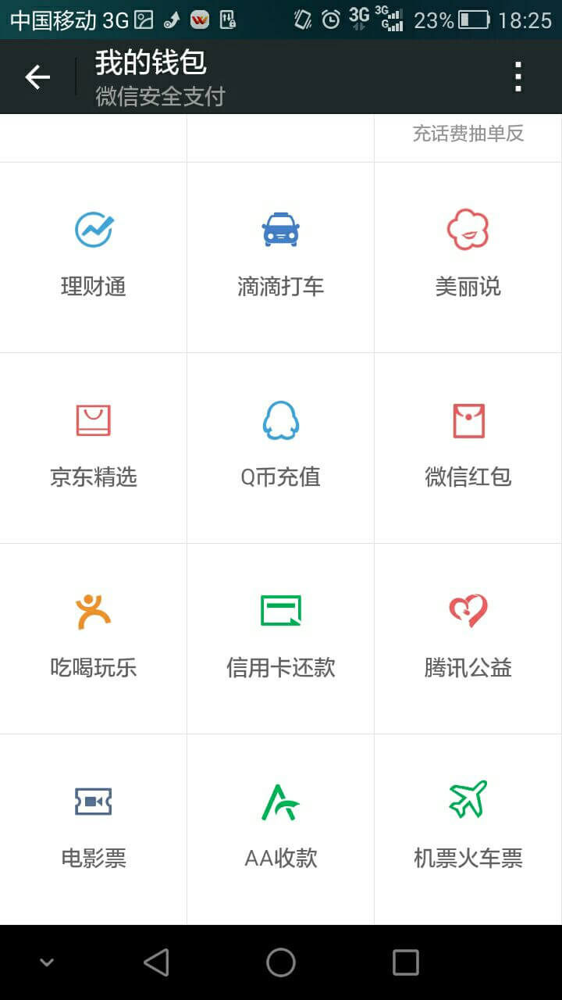

##  
## 1. 先看看升级前[6.1]和升级后[6.2]的区别

**升级前：6.1** 

**升级后： 6.2** 

## 2. 我对这次升级的第一印象   

微信这次升级应该有不少改善的地方，我就 "钱包" 这个比较让我满意的功能点来谈谈我的感想。当时我打开钱包这个功能的时候，第一反应是 “wow，实在太赞了，终于把 “零钱” 这个按钮放出来了“。先说说我为什么喜欢零钱这个按钮，因为红包，常常抢红包，没几天我就会很好奇地去看看自己现在抢红包抢了多少钱，于是乎每次都要操作好几次：我 -> 钱包 -> 钱包 -> 零钱。而现在我只需要操作两次：我 -> 钱包 就可以看见我的零钱有多少了。一下子节省了两步，可能你会觉得这没什么稀奇的。可是我想说，对我这种经常使用这个功能来说的人，两步已经足够让我们惊喜了。   

好了，相信不少人看到我上面的说法，大都想说，众口难调，也许这个功能的升级只是让少部分我这种类型的用户满意而已，也许很多不想把 “零钱” 这个功能暴露出来的用户会吐槽这个改善点。yes，我相信是会有吐槽的用户。但是，我相信每一次升级，都肯定是经过深思熟虑的，肯定是经过验证的。这里就引出了一个很有趣的问题，在没有升级这个功能之前，微信产品组是基于什么来决定要改善这样一个功能的，是经过什么东西来验证这个功能的升级是有必要的？这个问题，也是我通过微信这次升级获得的思考和感悟----如何决定一个功能是否要改善？如何来预测用户的需求，或者说如何来预测用户对功能升级的反馈？   

## 3. 如何来决定一个功能是否需要改善   

其实，在感谢这次升级之余，我想过一个问题：我假设有很多用户向我一样，也很喜欢 ”零钱“ 这个功能的改善。但我确实很好奇，微信是怎么决定来要改善 ”零钱“ 这个功能的？作为一个做技术出生的，我从技术角度想了想，发现这个问题其实做起来，那是easy enough的，而且是完全可以量化的。

在[《参与感》](http://book.douban.com/subject/25942507/) 这本书中提到小米最初是如何呵护前几百个粉丝的，如何通过与粉丝的互动来改善小米的功能的。我想，一个反馈很好的功能升级，必然是在某种程度上与用户有所互动后的决定，或者说是在与用户 ”沟通” 后的决议。当然微信用户这么大，不可能向小米当初初创的时候一样，维护一个用户bbs来讨论用户的观点。必须要用一种更精准，更可以量化，可以解释，而且成本低廉的方法来做到与用户在功能点上的 “沟通”。   

好了，说了这么多废话，铺垫都全打好了，下面我就直接来说说在我看来，微信是怎么做到与用户 ”沟通“，微信是怎么决定要升级 ”零钱“ 这个功能的吧？  

以下情节，纯属虚构，若真属实，请叫我天才。。。。

## 4. 如何做到真正的参与感   

所有的产品，都是服务于用户。熟话说得好，不以恋爱为目的的约会都是瞎折腾，不以用户为女神的产品都是loser。既然产品的核心是用户，那我们关于产品所做的一切设计，优化甚至是改变都应该在改动之前与用户有过沟通，要确保用户对我们所做的改动有所认同。   

我很赞成小米初期的那种做法，维护一个简单的bbs，每天和粉丝们互动，收集需求，整理需求，规划产品，step by step地做到今天这个样子，值得借鉴和思考，但不可照搬。其一，因为人家的那种粉丝和其他很多产品的粉丝都不一样，人家的那种粉丝还有另外一个称呼 ”发烧友“，这些粉丝是有足够的耐心和愿意花足够的时间来反馈产品的优缺点和各自需求的。其二，当一个产品的用户数大了后，维护这个bbs将会话费大量人力物力，性价比太低。   

既然如此，既要和用户沟通，又要保证沟通成本，采用上面说的技术方案岂不是一个很不错的方法。而且上面说的技术方案，实现起来足够简单，而且可量化，可解释，甚至可跟踪。   

